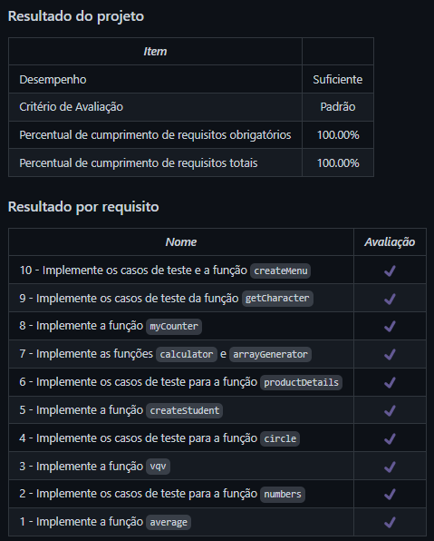

# JS Unit Tests
Projeto da [Trybe](https://www.betrybe.com/) - Bloco 7 - Implementação de funções em JavaScript e testes unitários com Jest.

## 💻 Projeto

Implementação de funções em JavaScript e testes unitários com Jest.

<details>
  <summary><strong>🏆 Meu desempenho</strong></summary><br />

  
</details>

## 🚀 Tecnologias
> Este projeto foi desenvolvido com as seguintes tecnologias:

- JavaScript ES6
- Jest

## 📌 Habilidades
> Neste projeto, desenvolvi as seguintes habilidades:

- Escrever testes unitários para funções utilizando o Jest para verificar o seu correto funcionamento;
- A partir de testes já implementados, escrever funções de forma que elas atendam aos testes propostos;
- Escrever testes e funções utilizando uma abordagem de desenvolvimento orientado a testes (TDD).

## ⬇️ Instalando dependências

```bash
npm install
``` 

## 🧪 Executando os testes

```bash
npm test
```

## 💬 Contatos

<div align="center" style="display: inline_block">
  <a href="https://julianoboese.github.io" target="_blank"></a> 
  <a href="https://www.linkedin.com/in/julianoboese" target="_blank"></a> 
  <a href = "mailto:juliano.boese@gmail.com"></a>
</div>

<!-- ## 📄 Licença

Esse projeto está sob licença. Veja o arquivo [LICENÇA](LICENSE.md) para mais detalhes.

[⬆ Voltar ao topo](#nome-do-projeto)<br> -->
